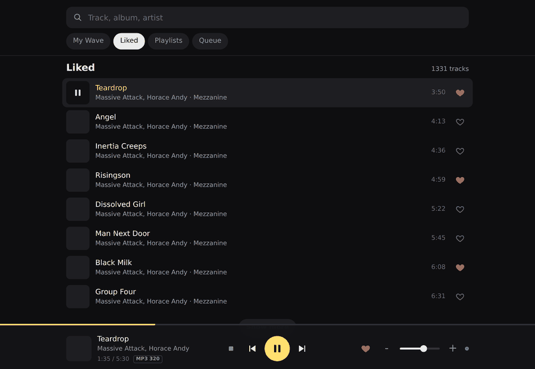
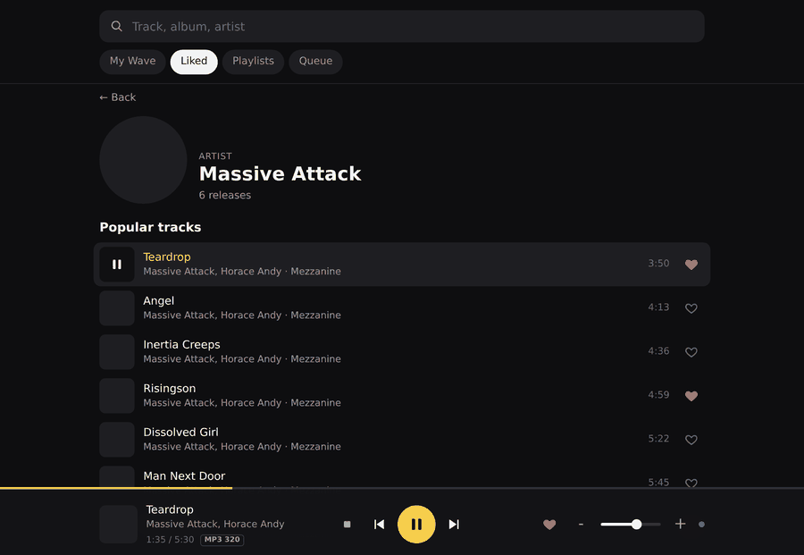
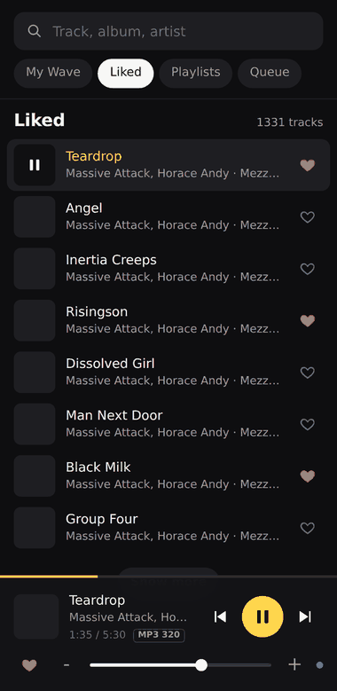

# ymusic-pi

A headless Yandex Music player for Raspberry Pi (and any Linux box), controlled from a
phone browser. No screen, no Chromium, no Bluetooth: the board plays the audio, your
phone is the remote.



Tested on Raspberry Pi 1B and 3B, Raspberry Pi OS (Debian trixie), MPD 0.23 and 0.24,
Python 3.11+, with a Behringer UMC204HD USB interface and with HDMI audio.

## Why

Commercial streaming boxes are closed, and the usual DIY answer (a full desktop plus a
browser) needs a screen and a Pi 4. This takes about 1500 lines total, runs on a 2012
single board computer, and is driven from any phone on the same network.

## How it works

```
Yandex API ──(signed link)──> file in RAM ──> MPD ──> ALSA ──> DAC
     ▲                            ▲
     │                            │ MPD protocol (UNIX socket or TCP 6600)
  ym_core.py ◀── ym_server.py ────┘
                      ▲
                 index.html (phone browser)
```

| File | Role |
|---|---|
| `ym_core.py` | service layer (Yandex) plus a small MPD protocol client |
| `ym_server.py` | HTTP server: panel API, queue, RAM cache, gapless handover |
| `index.html` | the panel: search, wave, likes, playlists, artists, albums, player |

Three layers that can be changed independently. **To support another streaming service
you only rewrite the top half of `ym_core.py`.** The MPD client, the server and the panel
stay as they are.

## Features

- search, My Wave (endless radio), Liked, playlists, queue
- artist and album pages, clickable artists, browser back button support
- play, pause, next, previous, seek, volume, like, live stream quality badge
- **gapless handover**: the next track is queued in MPD 25 seconds before the end
- **tracks are downloaded to RAM** (`/dev/shm/ymusic`) and handed to MPD as local files
- **server sent events instead of polling**, so the phone keeps the air quiet while a
  track plays (this matters for USB audio on small boards)
- URL commands for home screen widgets: `/api/cmd/up|down|pause|next|prev|stop`
- survives MPD restarts and token expiry
- installable as a home screen web app (manifest and icons included)
- English by default, Russian optional (`?lang=ru`, remembered in the browser)



## Install

```bash
git clone https://github.com/NeuralF/ymusic-pi.git ~/ymusic
cd ~/ymusic
pip install yandex-music            # or vendor it into ./pylibs
sudo sh install.sh                  # installs MPD, writes its config, enables services
python3 auth_device.py              # one time login: open the link, type the code
sudo systemctl restart ymusic-web
```

Before running `install.sh`, set the output device in it. Look it up with `aplay -l` and
write it **by name, never by card number**, for example `plughw:CARD=U192k,DEV=0`. Card
numbers move as soon as another USB device is plugged in.

The panel is then at `http://<board-ip>:8080`. On the phone use "Add to home screen".

## Hardware notes

It runs on any Raspberry Pi. The newer the board, the less tuning is needed.

**Pi 3 and newer**: works out of the box. Wi-Fi sits on its own bus, so it does not fight
with USB audio.

**Pi 1 and 2**: the USB controller is driven by the CPU, and a Wi-Fi dongle shares that
bus with the sound card. Without tuning you get a few audible dropouts per minute. With
the tuning described in [docs/TUNING.md](docs/TUNING.md) (longer USB queue, overclock,
unbinding unused USB drivers) a Pi 1B plays cleanly, which is what this project was
built and measured on.

The software side is already as lean as it can reasonably get: the track plays from RAM,
MPD reads it as a local file over a UNIX socket (no HTTP, no curl in the playback path),
and the panel pushes events instead of being polled. What remains is board tuning, not
code.



## Server API

```
GET  /                      the panel
GET  /api/state             one state snapshot
GET  /api/events            SSE stream, pushed only when something changes
GET  /api/search?q=
GET  /api/liked?offset=&limit=
GET  /api/playlists         /api/playlist?kind=&offset=
GET  /api/artist?id=        /api/album?id=
GET  /api/queue             /api/cmd/<up|down|pause|next|prev|stop>
POST /api/play              {tracks:[...], index:N, source:"..."}
POST /api/wave  /api/append /api/pause /api/stop /api/next /api/prev
POST /api/volume {volume:0..100}   /api/seek {pos:seconds}   /api/like {id, on}
```

## Porting to another service

Implement these in `ym_core.py` and leave the rest alone:

```python
get_client()                 # auth, cached client
reset_client()               # drop the cached client after an auth error
search(query, limit)         -> [track_dict, ...]
get_link_info(track_id)      -> (url, "MP3 320")   # fetch right before playing
liked_ids() / liked_tracks(offset, limit) / like(id, on)
playlists() / playlist_tracks(kind, offset, limit)
wave_tracks(queue_after)     # personal radio, return [] if the service has none
artist_page(id) / album_page(id)
```

`track_dict` is
`{id, title, artist, artists[{id,name}], album, album_id, duration, cover, available}`.
The panel knows nothing about any particular service.

## Design notes worth keeping

- **MPD rather than custom playback.** It owns the queue, pause, seek and decoding, and
  it survives a panel restart: the music keeps playing while the server reloads.
- **MPD protocol gotchas.** A reply ends with `OK` or **`ACK ...`** (not `ERROR`), the
  greeting is `OK MPD <version>`, and a stream is started with
  `clear` then `addid "url"` then `playid <Id>`. There is no `url` command.
- **UNIX socket.** Over it MPD accepts absolute local paths, over TCP it refuses them.
  That is how the RAM file is played with no HTTP hop.
- **Download, do not stream.** On small boards network traffic during playback causes
  audio dropouts. With the file local, the radio is silent while the track plays.
- **Signed links expire**, so the file is cached, never the URL, and URLs never reach
  the logs.

## Limitations

- This uses an unofficial Yandex Music API through the `yandex-music` library. That is
  against the service terms, it can break at any time, and it is meant for personal use.
- Lossless (FLAC) is not reachable this way: Yandex serves it to its own clients only,
  and a third party token gets `not-allowed`. Parts of the catalogue are only available
  at 192 kbps, which the panel shows honestly in the quality badge.
- Volume is software volume inside MPD. If your DAC has a hardware control, keep the
  software one at 100 percent and set the level on the device.
- The RAM cache is wiped on reboot, which is intended.

## License

MIT, see [LICENSE](LICENSE).
